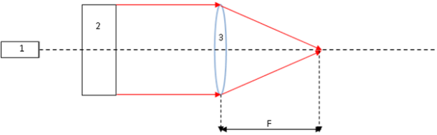
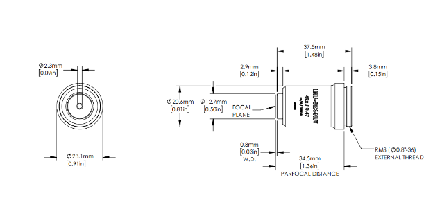
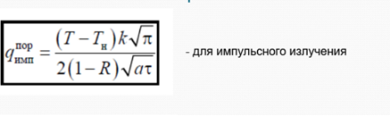
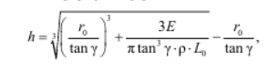
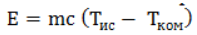

# LaserResearch
1\. Исходя из размера сфокусированного пятна (***r* = 1 мкм)** и длины волны (**λ = 355 нм**) подобрали объектив LMU-40X-NUV (<https://www.thorlabs.com/thorproduct.cfm?partnumber=LMU-40X-NUV>) .

Сделан чертеж оптической схемы:

1 – лазер с длиной волны λ=355 нм;

2 – коллиматор;

3 – микрообъектив LMU-40X-NUV;

F – фокусное расстояние, равное 5,3 мм.

Параметры одиночного объектива:

- числовая апертура NA=0.47;
- диапазон длин волн, на который рассчитан объектив – 325-500нм;
- порог повреждения покрытия линз при облучении лазерным излучением высокой интенсивности = 3.0 J/cm².

Привести чертеж объектива и уметь пояснить, что означают параметры объектива.

2\. Для лазера марки **BZ-100P** рассчитать плотность мощности в сфокусированном лазерном пучке исходя из значения энергии импульса.

q=Eτ\*S, где

` `q – плотность мощности в сфокусированном лазерном пучке

` `S = πr2 – площадь сфокусированного пучка

` `r – радиус сфокусированного пучка

` `τ=30пс-длительность импульса

` `Е = 100мДж - энергия импульса

` `D = 12мм – диаметр пучка

S=3.14\* 10-12 m2,

` `q= 100\*10-3Дж30\*10-12с\*3.14\*10-12 м2= 1.061\*1021 Втм2

Данные по размеру пучка на выходе лазера **BZ-100P**  и его расходимости: < 0.5 мрад

3\. Исходя из размера сфокусированного лазерного пучка рассчитали пороговую плотность мощности, необходимую для получения отверстия глубиной **2 мкм** на поверхности кварцевого стекла при облучении одиночным импульсом. 

**Исходные данные для кварцевого стекла:**

<b>ρ = 2201 кг/м3</b>– плотность кварцевого стекла;

<b>c = 1.56·105Дж/г</b> – удельная теплота возгонки кварцевого стекла;

<b>Tис = 2590°С</b> – температура испарения кварцевого стекла;

<b>Tком = 20°С</b> – комнатная температура.

α – 1.4\*10-6 м2/с коэффициент температуропроводности.

k – 1,38 Вт/(м·K) коэффициент теплопроводности.

R - 0,001 коэффициент отражения

Источник: <http://www.elektrosteklo.ru/FS_UV_rus.htm>

<table><tr><th colspan="1" rowspan="2">Материал</th><th colspan="5">Характеристики</th></tr>
<tr><td colspan="1">Плотность ρ, кг/м3</td><td colspan="1">Температура испарения Тис, oC</td><td colspan="1" valign="top">Объемная теплота возгонки c, 1011 Дж/м3</td><td colspan="1">Удельная теплоемкость c, Дж/кг·°С</td><td colspan="1" valign="top">Температуропроводность α, 10-6 м2/с</td></tr>
<tr><td colspan="1">Кварцевое стекло</td><td colspan="1">2201</td><td colspan="1">2590</td><td colspan="1">4\.05</td><td colspan="1">890</td><td colspan="1" valign="top">1\.4</td></tr>
<tr><td colspan="1">Кремний</td><td colspan="1">2330</td><td colspan="1">2600</td><td colspan="1">-</td><td colspan="1">678</td><td colspan="1" valign="top">88</td></tr>
</table>

Гост на кварцевое стекло: https://meganorm.ru/Data2/1/4294836/4294836678.pdf

q= 2590°C-20℃ Втм\*К\*3.142\*1-0,001\*1,4\*10-6 \*30\*10-12  =3.52\*1011Втм2

4\. Написать резюме, подходит ли лазер марки **BZ-100P** для получения отверстий глубиной ***h*  = 2 мкм** на поверхности кварцевого стекла при радиусе сфокусированного пятна ***r* =  1 мкм**.

`                                    `

<https://cyberleninka.ru/article/n/lazernoe-formirovanie-otverstiy-v-nemetallicheskih-podlozhkah/viewer> - ссылка на данную формулу

Количество энергии, необходимое для испарения тела массой m:

Где h – глубина отверстия

L = 2.1 \*106 Дж/кг– удельная энергия испарения материала

` `ρ = 2201 кг/м3– плотность кварцевого стекла

` `r = 1 мкм – радиус сфокусированного пучка

γ = 0.5 мрад – максимальное значение

m = ρV (ρ – плотность материала, V – объем кратера);

c – удельная теплоемкость материала;

Tис – температура испарения материала;

Tком – комнатная температура.

Если мы рассмотри наше отверстие, как тело, которое нужно испарить, то получим следующее значение:

Учтем, что V= π\*r2\*h,

где r -  радиус сфокусированного пятна;

h = *l* – глубина отверстия.

E= 2201кгм3\*π\*10-12м2\*2\*10-6м\*1052Джкг\* К\*2590°-20°К=3,2\*10-8Дж

P= Eτ= 3.2\*10-815\*10-12=2133 Вт

P= 60\*10-615\*10-12=4\*106 Вт

Энергия одного импульса лазера марки **BZ-100P** равна 100 мкДж, а энергия, требующаяся для испарения отверстия глубиной ***l*  = 2 мкм** на поверхности кварцевого стекла при радиусе сфокусированного пятна ***r* =  1 мкм** равна 32 нДж. Энергия, выдаваемая нашим лазером больше той, что нужна для проделывания нашего отверстия. 

Из этого можем сделать вывод, что лазер марки **BZ-100P** для получения отверстий глубиной ***l*  = 2 мкм** на поверхности кварцевого стекла при радиусе сфокусированного пятна ***r* =  1 мкм** – подходит. 

